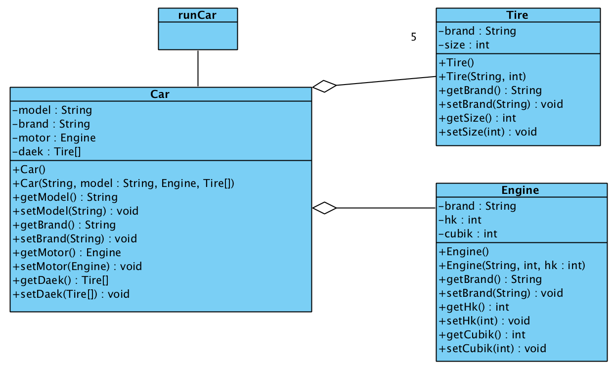

# 29_arrays_objects

## agenda

Implementering af associationer i klasser
* one-to-one - en attribut af type, der refereres til
* one-to-many - et attribut-array af typen, der refereres til

Engine skal implementeres som en Engine-attribut på Car, mens Tie skal implementeres som et array med Tire i Car.

## Øvelser

### Øvelser fra bogen p 548 og frem

Lav en metode, der tager et array og en værdi. Den skal returnere første placering af værdien i arrayet. Hvis værdien ikke findes i arrayet skal metoden returnere -1.

Lav en metode, der tager et array og en værdi. Den skal returnere sidste placering af værdien i arrayet. Hvis værdien ikke findes i arrayet skal metoden returnere -1.

### Skoleøvelse

Brug et array i Skole til at styre Student

Lav en metode, der tilføjer en Student til arrayet i Skole

Lave en metode, der fjerner en Student fra arrayet i Skole

Brug en taellervariabel til at holde styr på, hvor mange pladser i arrayet, der er brugt

Lav en søgemetode der giver studerende ud fra navnet på en Student
